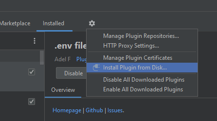

# Git commit template Plugin for IntelliJ

<!-- Plugin description -->
This plugin allows to create a commit message with the following template:

```
<type>(<scope>): <subject>
<BLANK LINE>
<body>
<BLANK LINE>
<footer>
<BLANK LINE>
<jira id>
```

<!-- Plugin description end -->

## Installation

1. Obtain the plugin zip file (either from a known source, or by following the steps in [Release](#release))
2. From a Jetbrains IDE, go to Settings -> Plugins
3. Click the options button


4. Navigate to the folder containing the plugin zip file
5. Select the zip file, and press "Open"
6. Press "save" to install the plugin

## Release

* Ensure the project is set up properly and runs in development.
* Run the `buildPlugin` gradle task
  * From IntelliJ IDEA, open the Gradle tool window, navigate to Tasks -> intellij -> double click on `buildPlugin`
* The zip file will be generated in `build/distributions`

## Original Work

This plugin is based off the [Git Commit Template With Jira Id](https://bitbucket.org/crm-uk/commit-template-with-jira-id) plugin.
